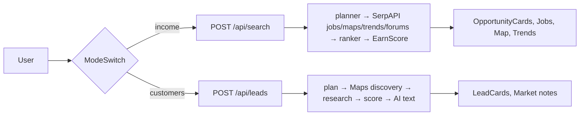

# EarnRadar

EarnRadar has two modes, switched by tabs in the UI (React state only,
nothing about the user is stored):

- **Find income ideas** (Mode 1): a user profile (skills, city, weekly
  hours, budget) becomes ranked income opportunities for India. A planner
  proposes targeted SerpAPI searches (Jobs, Maps, Trends, Forums), the
  results are cleaned and scanned by a rule-based Scam Shield, Claude ranks
  candidate opportunities, and a deterministic EarnScore formula with
  guardrails produces the final list. Nothing is ever auto-sent; income
  figures are always labelled estimates.
- **Find customers for my product** (Mode 2): a product offer (free text,
  city, optional monthly price) becomes ranked customer businesses from
  Google Maps. The pipeline plans Maps queries, discovers candidates,
  researches the top ones (review pains, existing-software signal, one
  competitor search), scores them as **signals, not guarantees**, and adds
  short grounded explanations plus a human-reviewed outreach draft per lead.
  Lead websites are never fetched (SSRF safety). Nothing is ever auto-sent.

`POST /api/outreach` drafts short WhatsApp messages for both modes
(max 70 words, editable, opened via `wa.me` by the user, never auto-sent).

## Architecture



```text
backend/app/modes/customers/   plan, discover, research, score, text, budgets
backend/app/services/           shared SerpAPI cache, LLM seam, outreach
frontend/src/components/        ModeSwitch, OfferForm, LeadCard, MarketNotes, ...
```

See `backend/README.md` for the backend details and `docs/` for the
product/technical documents (`docs/API.md` covers `POST /api/leads`).

## Quick start

Backend:

```powershell
cd backend
python -m venv .venv
.\.venv\Scripts\Activate.ps1
pip install -r requirements.txt
Copy-Item .env.example .env
# edit .env: set SERPAPI_KEY and ANTHROPIC_API_KEY
uvicorn app.main:app --reload
pytest
```

Frontend:

```powershell
cd frontend
npm install
Copy-Item .env.example .env
# edit .env: set VITE_API_URL (and optionally VITE_ACCESS_CODE)
npm run dev
npm test
npm run build
```

## Environment variables

Every key in `backend/.env.example`. "Render" marks keys also present in
`render.yaml` (`CACHE_DB_PATH` is local-only: the SQLite file is ephemeral
on free-tier hosting).

| Variable | Default | Render | Notes |
|---|---|---|---|
| `SERPAPI_KEY` | - | yes | SerpAPI key for Jobs/Maps/Trends/Forums |
| `ANTHROPIC_API_KEY` | - | yes | Claude API key |
| `ANTHROPIC_MODEL` | `claude-sonnet-5-5` | yes | Must be a valid Anthropic model id |
| `ALLOWED_ORIGINS` | `http://localhost:5173` | yes | Comma-separated; never use `*` in production |
| `CACHE_DB_PATH` | `cache.db` | no | SQLite cache file (local) |
| `TTL_JOBS_HOURS` | `24` | yes | Cache TTL for Jobs |
| `TTL_MAPS_HOURS` | `24` | yes | Cache TTL for Maps |
| `TTL_TRENDS_HOURS` | `168` | yes | Cache TTL for Trends (7 days) |
| `TTL_FORUMS_HOURS` | `72` | yes | Cache TTL for Forums |
| `RATE_LIMIT_SEARCH_PER_HOUR` | `10` | yes | Per-IP search limit |
| `RATE_LIMIT_OUTREACH_PER_HOUR` | `30` | yes | Per-IP outreach limit |
| `ACCESS_CODE` | `` (empty = open) | yes | Soft gate, not a secret |
| `TRUSTED_PROXY_HOPS` | `1` | yes | Verify with one real request |
| `MAX_SERP_CALLS_PER_DAY` | `300` | yes | Global daily SerpAPI budget (`0` = unlimited) |
| `MAX_LLM_CALLS_PER_DAY` | `500` | yes | Global daily Claude budget (`0` = unlimited) |
| `APP_ENV` | `development` | yes | Set `production` on Render |
| `ENABLE_DOCS` | auto | yes | Interactive docs override |
| `SCORE_MODE` | `blend` | yes | `blend` averages AI and deterministic signals |
| `RANK_CACHE_HOURS` | `0` (off) | yes | Final ranked-response cache |
| `LLM_TIMEOUT_SECONDS` | `60` | yes | Per-call Claude timeout |
| `SERP_TIMEOUT_SECONDS` | `40` | yes | Per-call SerpAPI timeout |
| `LOG_LEVEL` | `INFO` | yes | Root log level |
| `ENABLE_CUSTOMER_MODE` | `true` | yes | Mode 2 kill-switch (`false` → 404 on `/api/leads`) |
| `LEAD_RESEARCH_TOP_N` | `5` | yes | Researched leads per request (hard cap 8) |
| `MAX_LEAD_SERP_CALLS_PER_REQUEST` | `12` | yes | Live SerpAPI calls per leads request |
| `MAX_LEAD_SERP_CALLS_PER_DAY` | `150` | yes | Leads day sub-budget (`0` = unlimited) |
| `LEADS_REQUEST_DEADLINE_SECONDS` | `45` | yes | Wall-clock deadline per leads request |
| `RATE_LIMIT_LEADS_PER_HOUR` | `5` | yes | Per-IP leads limit (separate bucket) |
| `LEADS_CACHE_HOURS` | `6` | yes | Leads response cache (`0` = off) |

## Docs

- `docs/` holds the authoritative product documents (`EarnRadar-Master-Guide.md`,
  `EarnRadar-PRD.md`, `EarnRadar-PDD.md`, `EarnRadar-Tech-Stack-and-Structure.md`),
  plus `docs/RELEASE_CHECKLIST.md`, `docs/API.md` (`POST /api/leads`),
  `docs/ADR-0001-customer-mode.md`, `docs/RUNBOOK.md` and `docs/DATA-HANDLING.md`.
- Backend API reference: run the backend and open `/docs`.

## Responsible use

Lead scores are signals from public data, not guarantees — verify details
before contacting any business. When reaching out (engineering guidance,
not legal advice): comply with India's DPDP Act 2023 and applicable
telecom/WhatsApp rules on unsolicited messages, prefer calling a
business's published number once, honour opt-outs immediately, and never
treat the app as an auto-messenger: every draft needs human review.

## Deployment

- Backend: Render, root directory `backend`, build
  `pip install -r requirements.txt`, start
  `uvicorn app.main:app --host 0.0.0.0 --port $PORT` (see `render.yaml`).
- Frontend: Vercel, root directory `frontend`.
- On Render, verify `TRUSTED_PROXY_HOPS` with one real request, set the
  SerpAPI/LLM daily budgets, use the exact frontend URL (no trailing slash)
  in `ALLOWED_ORIGINS`, and keep API keys only in the hosting dashboards.
