# EarnRadar frontend architecture

## Data flow

```mermaid
flowchart LR
    User --> Pages["pages/ (Landing, Home, Customers, info)"]
    Pages --> Sessions["sessions (search / leads / shortlist contexts)"]
    Sessions --> Hooks["api/hooks (useSearch, useLeads, useOutreach)"]
    Hooks --> Client["api/client (fetch, retry, friendly errors)"]
    Client --> API["backend /api/search, /api/leads, /api/outreach"]
    API --> Zod["api/schemas (Zod validation)"]
    Zod --> Cards["cards, maps, charts"]
    Cards --> Actions["copy, wa.me link, print, CSV export"]
```

- Pages own layout only. All server communication flows through the
  session contexts, which keep `idle | loading | success | error` plus a
  `retrying` cold-start flag and the last input for retries.
- `api/client` retries once on network failure or 502, then maps every
  failure to friendly copy. Raw upstream text never reaches the UI; the
  backend `request_id` travels as a copyable support code.
- Outreach (`POST /api/outreach`) returns an editable draft plus a safety
  note. Income targets send name/type/address/rating; lead targets add
  `product_summary`. Phone numbers are never in the request body.

## Error handling matrix

| Backend / transport | Frontend copy | Where it shows |
|---|---|---|
| 422 `invalid_input` | Field errors + `Invalid request: …` | Inline form errors, focus to first field |
| 401 `unauthorized` | Access-code message | Error alert + support code + Retry |
| 429 `rate_limited` (+`Retry-After`) | “Too many requests… about N seconds.” | Error alert + Retry |
| 429 `budget_exhausted` | Daily-capacity message | Error alert + Retry |
| 404 `feature_disabled` | Switched-off message; customers tab hides | Alert, or tab hidden by probe |
| 500 / 502 / 503 | “Try again in a minute.” + waking message while retrying | Alert + staged progress note |
| Network failure / 60 s timeout | Connection message | Error alert + Retry |
| Cancelled request | Silent revert to last settled snapshot | No UI change |
| 200 failing Zod validation | “Unexpected response…” | Error alert (schema drift) |
| 413 body too large | Shorten-input message | Error alert |

## Map layers

| Map | Layers | Pins |
|---|---|---|
| `JobsMap` (income) | Jobs (risk color + letter + shape), Local businesses (toggle) | Jobs with `lat/lng`; city/`approximate` precision flagged; cluster past 15; list/map sync; empty state without coords |
| `LeadsMap` (customers) | Leads (size grows with score), Shortlist (toggle) | Leads with `lat/lng` (rare today → compact empty state); list fallback; legend; two-finger pan hint |

Tiles are OpenStreetMap with attribution. The app never requests browser
geolocation (locked off in `Permissions-Policy`). A compact
`ErrorBoundary` around each map keeps results visible if Leaflet fails.

## Caching and credits

Identical repeat searches return `credits_used: 0`. Every results view
shows “credits used · served from cache”, degraded/partial banners, and
`request_id`-keyed notices. The customers availability probe is a single
cached `POST /api/leads` per session.
